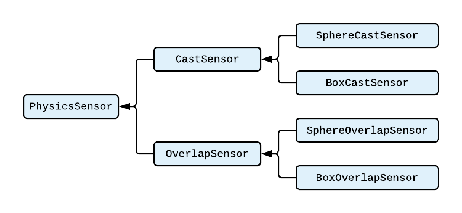

Utility components for working with Raycasts using GameObjects

# What is this
This library wraps Physics.**X**Cast and Physics.Overlap**X** methods into MonoBehavior, and acts like a configurable sensor.
With that, you can write logic that is less focused on ray casting logic, and more on reaction when ray hit something.

# Features
* **Wraps all cast/overlap logic into separate class**
* **Multiple inheritance levels allows to write logic that is independent of sensor type (Cast or Overlap) and its shape (Ray, Sphere, Capsule, Box)**
* **Designed for embedding into existing logic**
* **Correctly applies all transforms, like collider with similar shape**
* **Highly detailed gizmo, so you can see how sensor acts**
* **Automatic method selection based on sensor settings**
* **Uses NonAlloc methods with reusable arrays for Multi-Object casts**
* **Since this is simple behavior, you can animate its values like any other object**

---

# Usage
- Add desired sensor to scene, and configure its detection params
   - **SphereCastSensor** | **BoxCastSensor** | **SphereOverlapSensor** | **BoxOverlapSensor**
- Create field in your behavior with same type, assign your sensor in inspector
- Call `UpdateSensor()` when you need to update your sensor
- Use obtained information any way you want

```CS
public class CharacterObject : MonoBehaviour
{
    public CastSensor groundSensor;

    public void Update()
    {
        groundSensor.UpdateSensor();
        
        if (groundSensor.HasHit)
        {
            var normal = groundSensor.RayHit.normal;
            // ground movement logic
        }
        else
        {
            // airborn movement logic
        }
    }
}
```

# Architecture
This library is designed to allow faster Cast/Overlap iteration cycles, and give ability to easily swap between sensor types without code modification.


###### Ray/Capsule casts are absent because they are SphereCast's special cases. If Radius = 0, Ray cast is used for detection, if Width > 0, Capsule cast is used. Similar logic applies to overlap sensors.

Every inheritance level has logic that allows to work with results independently of sensor type. So, if you just need to check for object prescence, you can use base class - PhysicsSensor just to get basic information about hit (Is detected something, Collider of detected object). With that, you can assign any sensor to that property, and if you need to change from BoxOverlap to SphereCast, you dont even need to modify your sources, you can just swap your sensor.

Sensor **is not updated automatically**, you need to call `UpdateSensor()` for that. Here is reasons:
- Every game object uses casts in his own lifecycle, which can be in update/fixed update/coroutine/whatever
- There is no guarantee that sensor will be used every frame
- Often you want to keep last cast information untill next update

# Installation
If your Unity/PackageManager supports git dependencies, just add this entry into **Packages\manifest.json**
```
"ru.threedisevenzeror.sensorkit": "https://github.com/3DI70R/SensorKit.git"
```
And all these scripts will be included in your project as dependency.

Otherwise, you can just copy files from `Assets/Scripts/Runtime` to your project.
